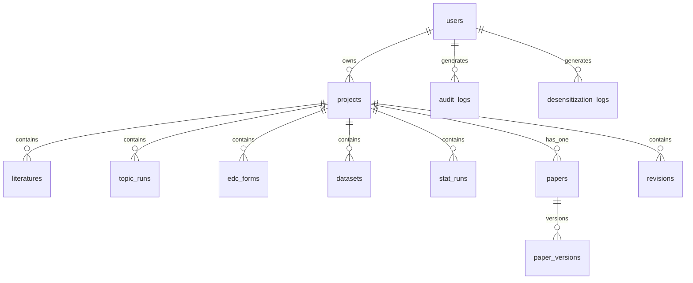

# 数据库设计文档（MVP）

## 概述

- **DBMS**：MySQL 8，字符集 utf8mb4。
- **ORM**：JPA `ddl-auto: update`（生产建议改为 Flyway/Liquibase 显式迁移）。

## ER 关系（Mermaid）

## 表说明

### users

| 字段 | 类型 | 说明 |
|------|------|------|
| id | BIGINT PK | |
| username | VARCHAR(64) UNIQUE | 登录名 |
| password_hash | VARCHAR | BCrypt |
| display_name | VARCHAR(128) | 显示名 |
| role | VARCHAR(32) | USER / ADMIN |
| created_at | TIMESTAMP | |

### projects

| 字段 | 类型 | 说明 |
|------|------|------|
| id | BIGINT PK | |
| owner_id | BIGINT FK → users.id | |
| name | VARCHAR(256) | 项目名称 |
| description | TEXT | |
| progress_percent | INT | 0–100 演示用完成度 |
| stage | VARCHAR(64) | 阶段标签 |
| created_at / updated_at | TIMESTAMP | |

### literatures

项目下文献；`stored_path` 为加密文件绝对路径；`extracted_text` 为解析文本；`analysis_json` 为 AI 结构化结果。

### topic_runs

`type`：GENERATE / TIMELY / EVALUATE；`input_text` / `output_json` 记录入参出参。

### edc_forms

`schema_json`：字段数组（含 CSMAR/Akshare 映射）；`share_token`：公开采集链接；`submissions_json`：提交行 JSON 数组。

### datasets

上传原始数据加密路径；`clean_report_json`；`processed_path` 清洗后加密文件。

### stat_runs

`type`：DESCRIPTIVE / TTEST / OLS；`config_json` / `result_json` / `chart_spec_json`。

### papers / paper_versions

项目 1:1 论文主表；`paper_versions` 保留历史内容与版本号。

### revisions

审稿原文 `raw_comments`；`parsed_json`；`suggestions_json`；`response_letter`。

### audit_logs / desensitization_logs

合规留痕：`action`、`resource_type`、`hits_json`、`rule_version`、`content_hash` 等。

## 索引建议（生产）

- `projects(owner_id)`
- `literatures(project_id)`
- `edc_forms(share_token)` UNIQUE
- `audit_logs(user_id, created_at)`
